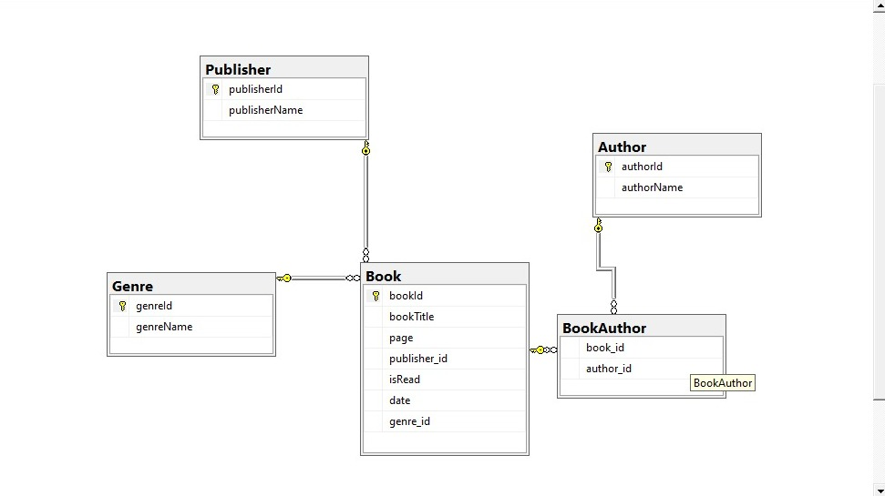
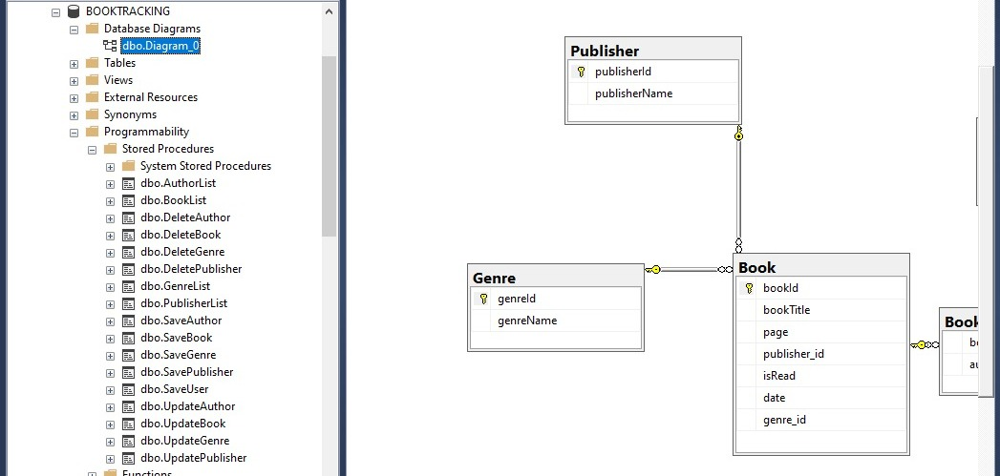
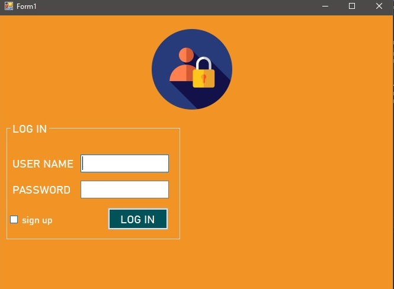
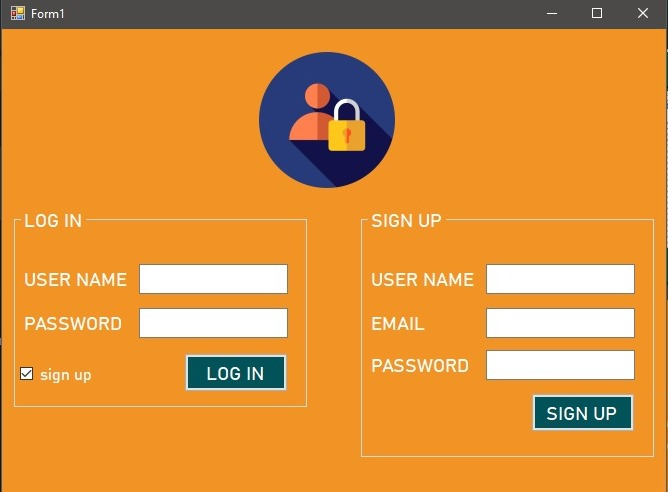
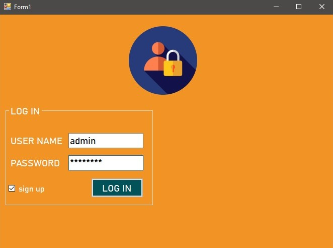
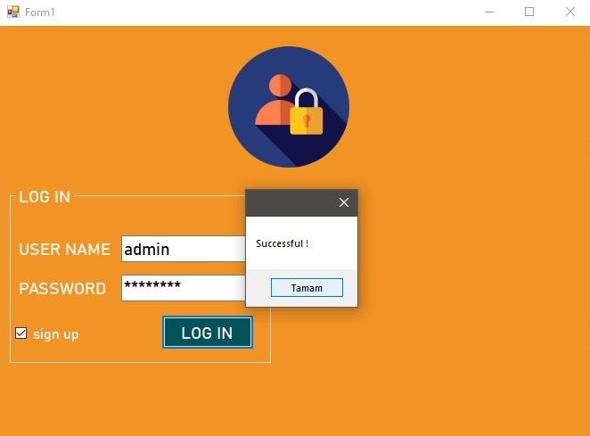
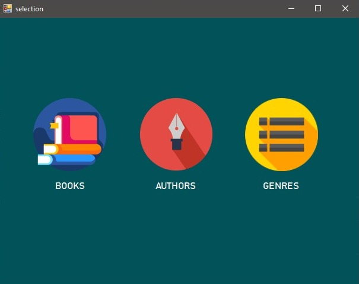
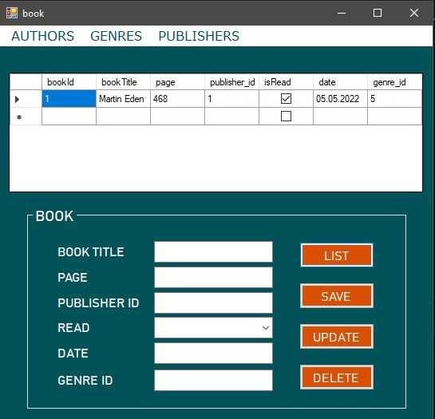

# book-tracking
## ADO.NET-DBFirst-CRUD
This is an ADO.NET project with DB First Approach. You can add your books to the database and keep tracking that your have read books. 
### Used Technologies

- Programming Language: C# with WinForms
- Database: MSSQL and Stored Procedure

